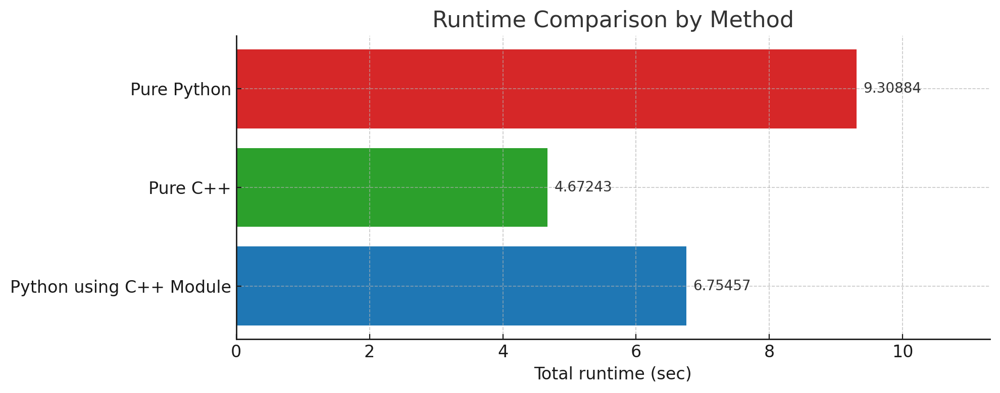

# googleSTEP

## File Descriptions

| File name, folder name               | Usage                             | Command |
|-----------------------|--------------------------------------------------|---------|
| homework1.py          | Main code for homework1                          |python homework1.py [-h] -w WORD|
| homework1_class.py    | Contains a class with functions used in homework1|
| homework1_test.py     | Test script for homework1                        |python homework1_test.py|
| homework2.py          | Main code for homework2                          |
| homework2_test.py     | Test script for homework2                        |homework2.py [-h] -t TARGET -a ANSWER|
| library               | Library using c++ for homework1                  |
| runtime_calculator    | Calculate each runtimes for python, c++, c++ and python|

# Homework1
### Time complexity
Given the target_word and dictionary, find the anagram of the target_word in dictionary.

M: target_word's length

N: dictionary's length

Q: how many times they search the anagram of different words in the dictionary.

L: the length of the longest word in dictionary

In a greedy way, we rearrange the target_word(O(M!)) and then comapre with all the words in dictionary.
If we do Q times, the runtime will be

O(Q * M! * N).

Assume that N has a large number, we can decrease the runtime.

Next, if we can sort the dictionary(O(N * logN)) we can do binary search to find the anagram.
Moreover, considering that we only sort the dictionary once, the runtime will be

O(N * logN + Q * M! * logN).

We cannot conclude that this is faster than the greedy way, but based on how many
times you request and the length of the target_word, this will be faster.

Finally, to make it even faster, we pay attention the fact that we need to rearrange the target_word.
Considering that anagram means they have the same component and if they are sorted,
if we sort the each word in dictionary and the target_word is also sorted, it is not needed to be rearranged.

To take this way, we first sort the each word in the dictionary but still need to store the original word,
we will make a pair of (sorted_word, origianl_word) for each of the word in dict.(N * L * logL) This process is only done once.

Then sort the dictionary again by sorted_word. (N * logN)
Then sort the target_word. (M * logM)
Then use the binary search to find the same sorted_word as the sorted target_word. (logN)

So the total runtime will be

O(N * L * logL + N * logN + Q * M * logM * logN)

### More effective algorithm
We created a sorted new dictionary, but if you want to find the sorted_word and get the origianl word,
store them in dictionary and use O(1) to find the correspoinding origianl word.
In this way, we don't need to do binary search.

### Test
We will test in the small dictionary whose length is less than 10.
However, this function is assuming that you use the same dictionary and they will only sort the
dictionary once.

We will create a new class that can test the different dictionary and also sort it once no
matter how many request you do.

## Homework2
### Time complexity
This time, we will use a part of the letters in the targeted_word and find the anagram that has the highest score.
Fisrt we can make use of the homework1's algorithm.

We need to get all the subset of the targeted word.(O(2^M)).
Then do the same thing as the algorithm1.

The runtime will be
O(N * L * logL + N * logN + Q * 2^M * M * logM * logN)

Considering that anagrams can be created as long as the targeted_word has enough letters.
So this time, we will use the letters dictionary for both targeted_word and words in dictionary.

First, we create a pair of letters dictionary and the original word for each word in dictionary.(O(L * N))

We create a dictionary for the letters in targeted_word(O(M))

Then we will compare the letters in targeted_word and each word in dictionary and check if it is a subset of the targeted_word. If so, we will get the score and store to list. (O(M * N))

After getting the all possible anagrams and their score, choose the best anagram and its score.
(O(length_longest_possible_anagram))

The total runtime will be

O(L * N + Q * (M + M * N + length_longest_possible_anagram))

### More efficient algorithm
Is it necessary to hold all the possible anagrams to get the highest score?

If the dictionary is sorted by score, the first anagrams we find is guaranteed to have
the highest score.

the runtime will be

O(L * N + N * logN + Q * (M + M * (the times to find the highest score(most is way less than N))))

## More efficient way in different language
Considering that c++ or c language runs faster than python, we created a library that can be
imported by python file and compare runtime for this.

### C++ vs python
Compiled languages vs. Interpreted languages

C++ is a compiled language, meaning the code is converted into machine language ahead of time. As a result, the CPU can understand and execute it directly, making it very fast.

Python is an interpreted language, meaning it reads and processes the code line by line at runtime. This introduces more overhead compared to C++, resulting in slower performance.

### Make C++ version
`cd library`

`g++ -O3 -std=c++11 main.cpp -o main`

`./main`

### Make python library with c++
1. use c++ to write the hw1 using class.

2. add code in cpp file.
```
PYBIND11_MODULE(anagramfinder, m) {
    py::class_<AnagramFinder>(m, "AnagramFinder")
        .def(py::init<std::vector<std::string>>())
        .def(py::init<const std::string&>())
        .def("find_anagram", &AnagramFinder::find_anagram);
}
```

3. create setup.py
```
from setuptools import setup, Extension
import pybind11

ext_modules = [
    Extension(
        "anagramfinder",
        ["anagramfinder.cpp"],
        include_dirs=[pybind11.get_include()],
        language="c++",
        extra_compile_args=['-std=c++11'],
    ),
]

setup(
    name="anagramfinder",
    version="0.1",
    ext_modules=ext_modules,
    include_package_data=True,
    package_data={
        "": ["words.txt"],
    },
)
```
4. `pip install pybind11`

5. `python setup.py build`

6. `pip install -e .`

7. then be able to use import anagramfinder in main.py

### Compare efficiency for runtime for three versions

1. Pure Python

2. Pure C++

3. Python + C++ Module

To compare these, I created random 100 meaningful words with these three
files([random_words.txt](./runtime_calculator/random_words.txt)), and calculate the toatl runtime.

#### How to run

1. Pure Python

`cd runtime_calculator`

`python anagramfinder_python.py`

2. Pure C++

`cd runtime_calculator`

`g++ -O3 -std=c++11 anagramfinder.cpp -o main`

`./main`

3. Python + C++ Module

`cd runtime_calculator`

`python anagramfinder.py`

#### Runtime Comparison by Method


### Todo
make this library public and can be downloaded using pip