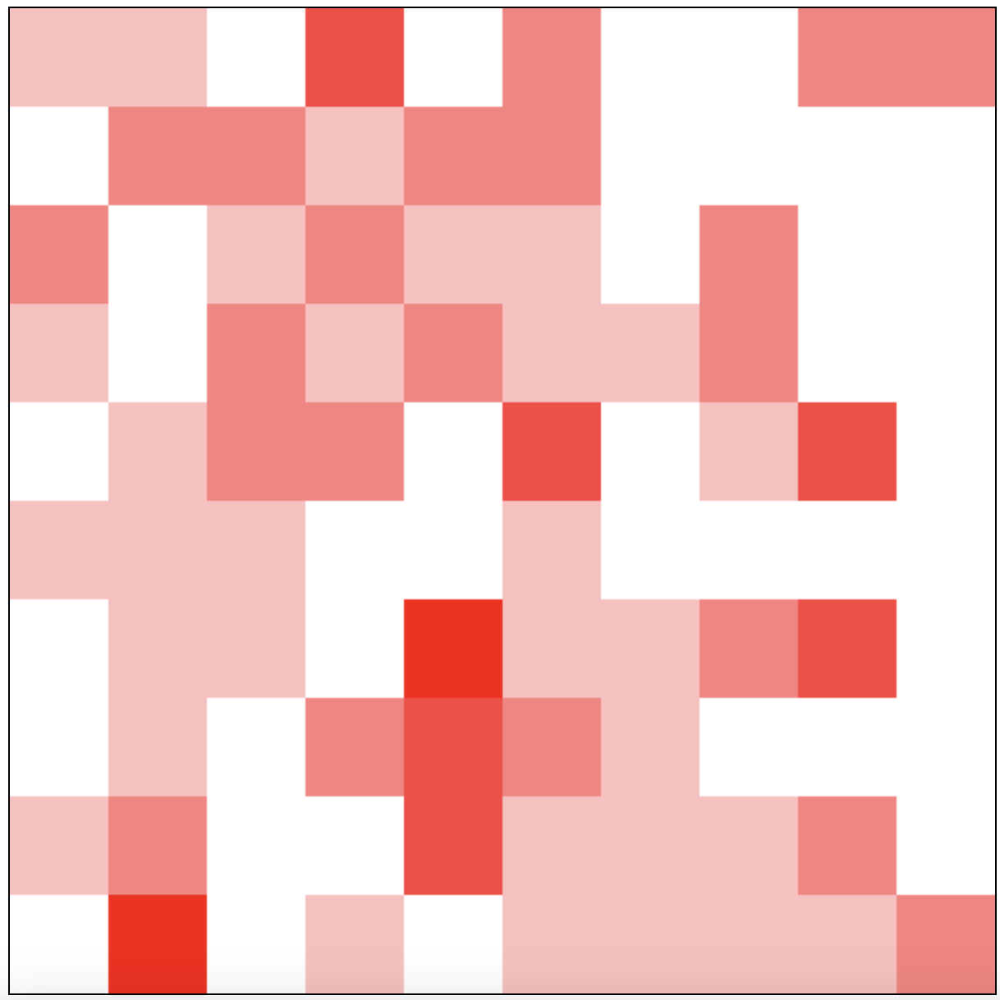
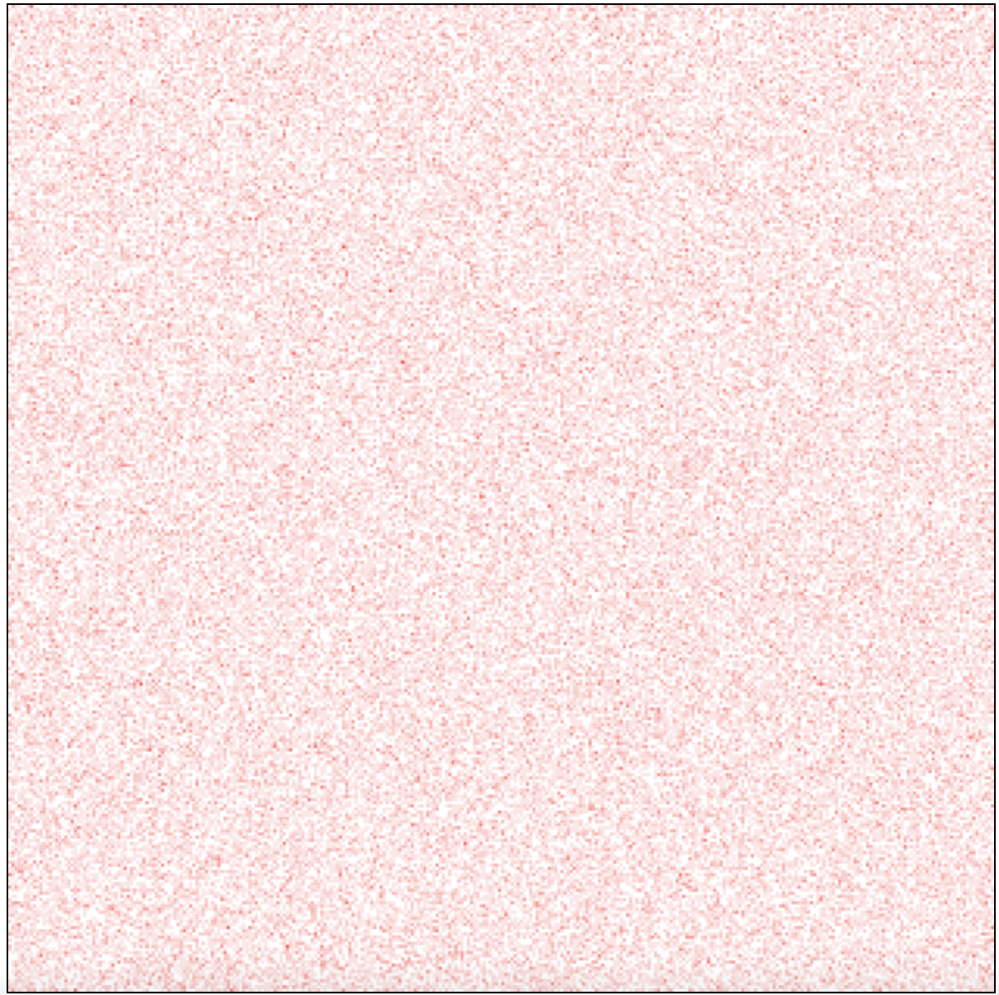
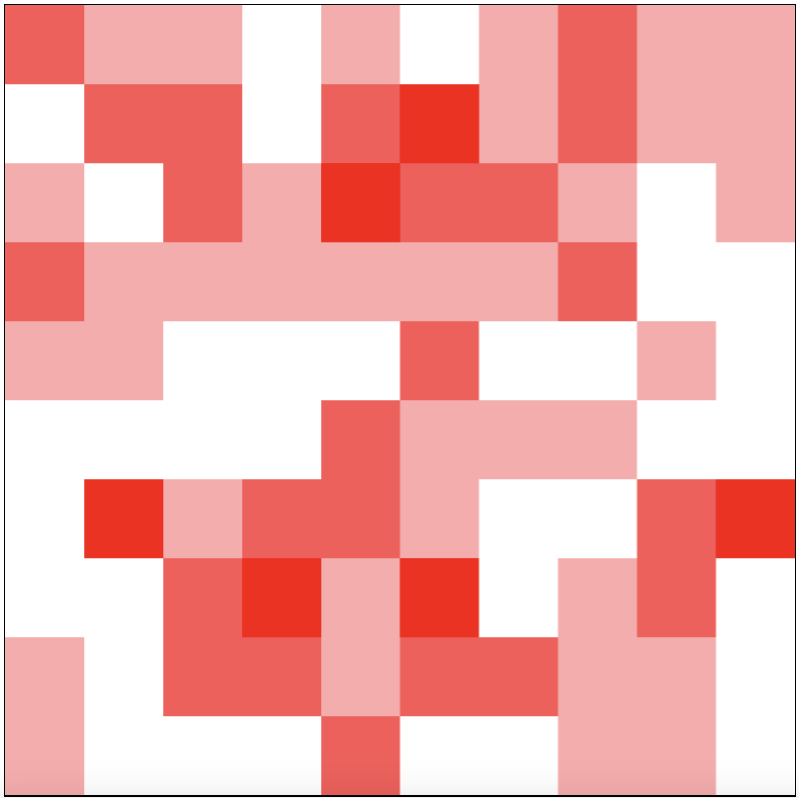
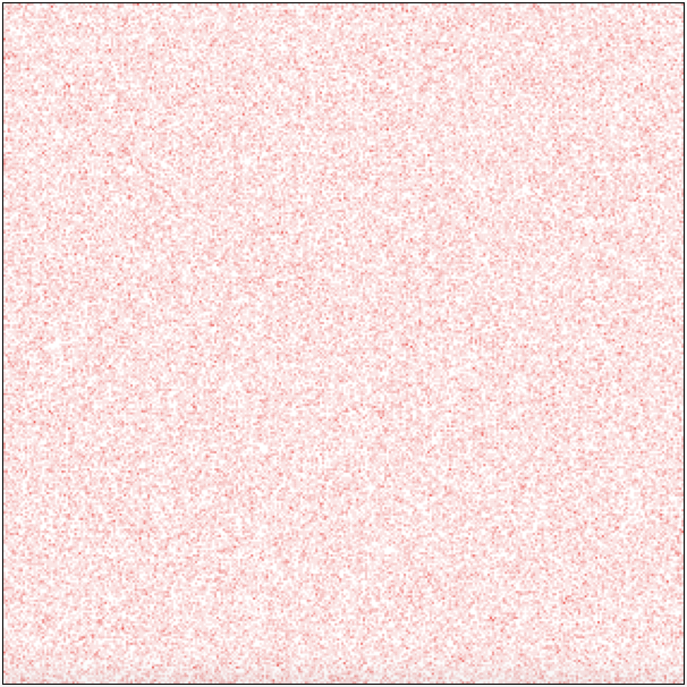
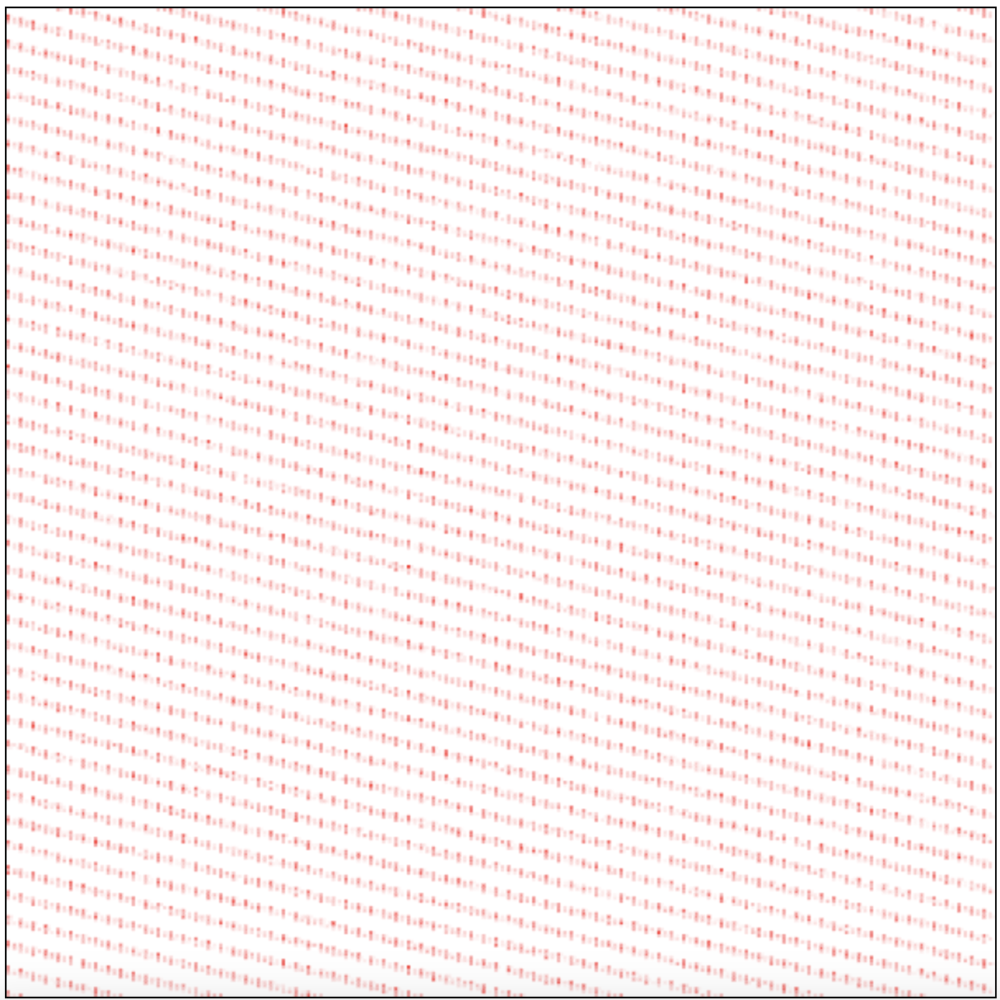
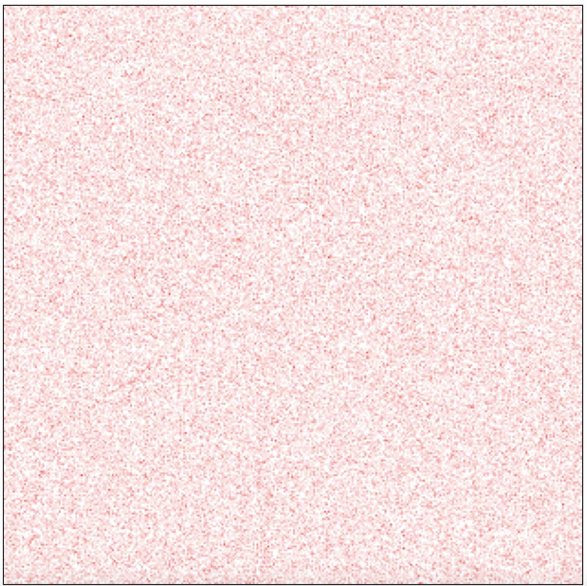

# googleSTEP

## File Descriptions

| File name, folder name               | Usage                             | Command |
|-----------------------|--------------------------------------------------|---------|
| homework1.py          | Main code for homework1                          |python homework1.py|
| homework2.txt          | Answer for homework2                            |           |
| homework3.txt          | Answer for homework3                            |           |
| homework4.py           | Main code for homework4                         |           |
| hashmap_visualize      | A website to visualize the customized hash map  |url: https://mimimimi2002.github.io/googleSTEP/|

# Homework1
## Overview
Implement hash function. We have a hashmap table(bucket) with the size of 97 as default.
Each bucket holds a linked list that stores a pair of key and value which has the same calculated hash. This calculated by our own hash_function and get the index of bucket by the remainder when divided by the bucket size.

`index = hash_function(key) % bucket_size`

## Resize
Hash map has a issue with memeory where if the items are almost full of hash map, increase the size of hashmap and if the items only take up small amout of hash map,
decrease the sisze of hashmap.
This time, I implement this by increasing the size when the number of items takes up 70 % of bucket size and decreasing the size when it takes up 30 % of bucket size.

## Hash function
Hash function calculates the hash number which is a number that represents the key.

## What is the good hash size and good hash function?
To make sure the index for each element is distributed evenly, we need to carefully determine the size of hash map and hash function to avoid collision.

### What is good hash size?
When increasing the size, is it ok to just double it? After doubling it, the size is even number that might cause the conflicts more easily. For example,
the reminder of even number divided by even number is even and
the reminder of odd number divided by even number is odd.
Therefore, I expect that the odd number and if it is prime number, it can distribute the index almost evenly.

### What is good hash function?
Ideally, the hash function will not produce the same number if the key is different.
Also, it needs to be distributed to prevent the numbers from clustering around certain values. We use ascii code for each character in string to create a hash number for that string.

## A tool to visualize hash map
Although we predict some of the features of the hash function and the size of hash map can contribute to the distribution of index of table, it is challenging to visualize how these features can affect the distribution.
We create a tool that can visualize the hash map by putting table size and number of keys and range of key (we conver the number that is range between 0 to this number and conver to string as input) and how to implement hash map and output the two kind of way to visualize hashmap, one is the grids with numbers with dense red color as the numbers that index holds is large. The other is to　dot the canvas with red point.

### How to use the tool to visualize hash map?
1. visit `https://mimimimi2002.github.io/googleSTEP/`

2. put the table size in Hash table size blank, the size of keys, the range of key, and
   the hash function using javascript.

3. click test button

4. The result of distribution including mean, variation, standard deviation, max, min of the number of keys each index holds will be shown.
   Also there is a number mode and canvas mode you can choose to visualize the hash map.

5. If you want to change the value of input at 4, change the input and click the test button, then different result will be shown.

## Experiments
There are several senarios we can test if it is good hash function and good hash table size. In the following explanation, ord(c) means the ascii code for c character.

### Experiment1.
#### Hash function : (index + 1) * ord(c) Table size : prime number

Considerinig that "alice" and "elica" is the same if their ascii codes are added.
If there is a factor that the order matters to create a unique hash number.

hash_function:
```
let hash = 0;
for (let i = 0; i < key.length; i++) {
  hash = (i + 1) * key[i].charCodeAt(0);
}
return hash;
```

- Hash table size 101
- Number of keys 100
- Range of key 100000

Result: Variance : 7.36, Max: 12, Min: 0

<p align="center">
  
  <br>
  <strong>Figure 1:</strong> Index distribution in <code>Experiment1</code> with small table size
</p>


- Hash table size 100003
- Number of keys 100000
- Range of key, 10000000

Result: Variance : 8340.83, Max: 9810, Min: 0


This does apply to the large number where it reqires the large number as hash number.

2. Hash function : primeNumber(larger than the maximum of ascii code) * primeNumber(larger than the maximum of ascii code) * ord(c) Table size: prime number

Considerinig that reaching to the large number and not overlapped with ascii code, we chosed large number of prime number and power them by 2.

hash_function:
```
let hash = 0;
const primesFrom256 = [257, 263, 269, 271, 277, 281, 283, 293, 307, 311];
for (let i = 0; i < key.length; i++) {
  hash += primesFrom256[i] * primesFrom256[i] * key[i].charCodeAt(0);
}
return hash;
```

- Hash table size 101
- Number of keys 100
- Range of key, 100000

Result: Variance : 1.02, Max: 4, Min: 0



- Hash table size 100003
- Number of keys 100000
- Range of key, 10000000

Result: Variance : 1.02, Max: 9, Min: 0




3. Hash table: Rolling hash: Table size: prime number
This is a common hash that does not occur the collision using the idea of converting to another base. In this way, the small number will be changed to corresponding number in that base.

```
let base = 256;
let hash = 0;
for (let i = 0; i < key.length; i++) {
  hash = (hash * base + key[i].charCodeAt(0));
}
return hash;
```

- Hash table size 101
- Number of keys 100
- Range of key, 100000

Result: Variance : 0.82, Max: 3, Min: 0




- Hash table size 100003
- Number of keys 100000
- Range of key, 10000000

Result: Variance : 1.00, Max: 8, Min: 0




## Result
Take into account that the hash number is unique and has a variety of range and make sure that the number is way bigger than the bucket size, it is more easy to distribute the index of bucket. Using prime number in hash function and bucket size is also efficeint way.

## Further question
If the hash function is good enough which can produce unique number, does table size matter? Is it still ok even you use the even number?
How about odd number, does it matter to be a prime number?
We will use Rolling Hash as hash number.

4. Hash table: Rolling hash: Table size: even number

- Hash table size 100000
- Number of keys 100000
- Range of key, 10000000

Result: Variance : 6.82, Max: 21, Min: 0




5. Hash table: Rolling hash: Table size: odd number

- Hash table size 99999
- Number of keys 99999
- Range of key, 10000000

Result: Variance : 1.02, Max: 8, Min: 0




## Conclusion
Good hash function is one that produces unique number and has a variety of range and way bigger than the bucket size. Regarding table size, it seems it doesn't matter the size is prime number but as long as it is odd number and hash function is good enough to distribute, it works.
